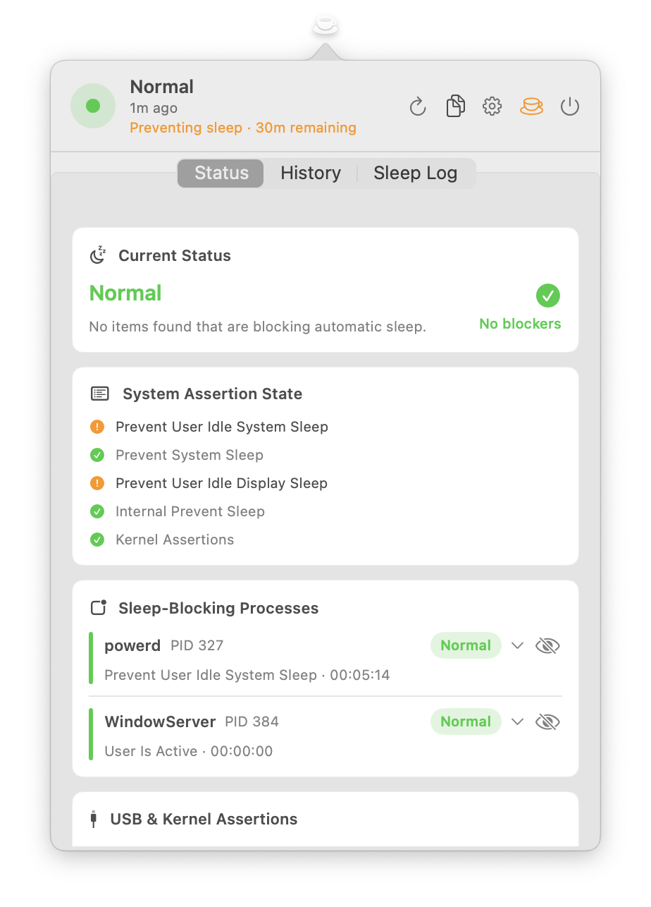
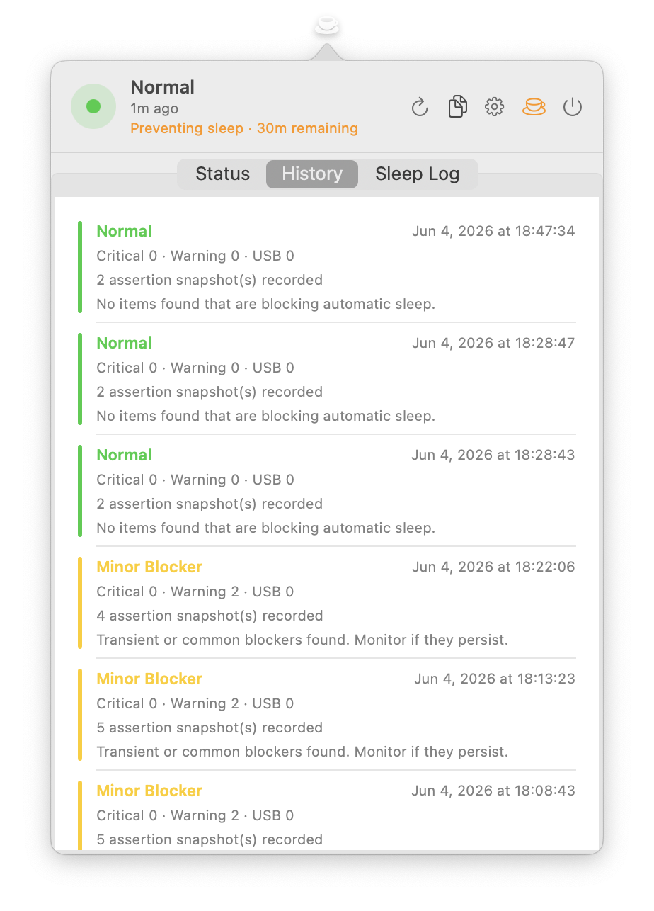
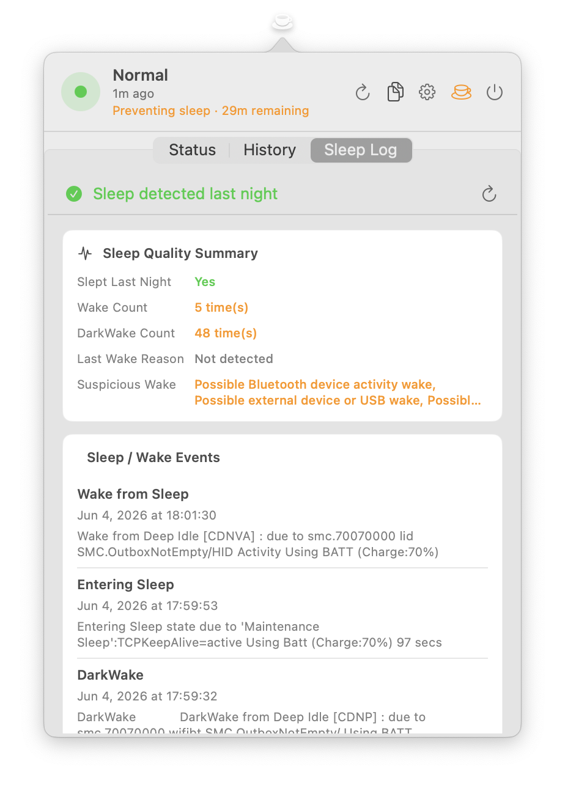
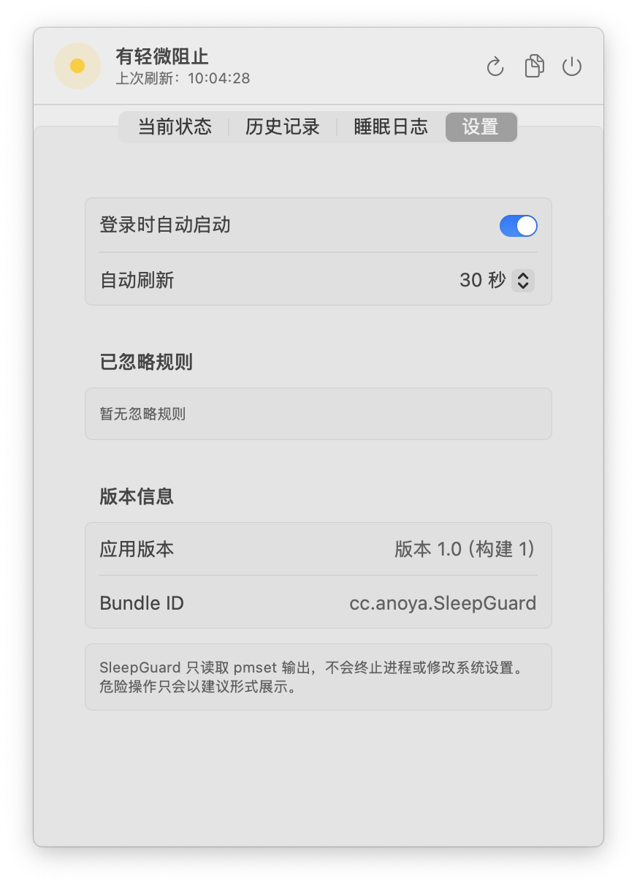

# SleepGuard

English | [简体中文](README.zh-CN.md)

SleepGuard is a macOS menu bar app for diagnosing why your Mac will not sleep automatically, keeps waking up, or stays blocked by external devices. It reads local `pmset` output, analyzes process assertions, USB/kernel assertions, and sleep logs, then highlights risks with practical troubleshooting suggestions.

## Screenshots

|  |  |  |  |
| --- | --- | --- | --- |
|  |  |  |  |

## Features

- Menu bar status: quickly inspect current sleep risk from the macOS menu bar.
- Current diagnosis: parses `pmset -g assertions` to identify blocking processes, assertion types, durations, and reasons.
- Risk levels: classifies common blockers as normal, warning, critical, or USB warning.
- USB and kernel assertion checks: points out docks, hubs, receivers, adapters, and other devices that may affect sleep.
- Sleep log summary: reads recent sleep, wake, DarkWake, and Wake reason records to help diagnose abnormal wake-ups.
- History and trends: stores the latest 200 diagnosis records and shows recurring blockers with observed duration.
- Ignore rules: hide known-safe process or device assertions so they no longer affect the overall status.
- Diagnostic report: copy a text report with status, raw assertions, trends, and recommendations.
- Auto refresh and launch at login: configure refresh intervals and optionally start SleepGuard when you log in.

## Requirements

- macOS 13.0 or later
- Xcode 15 or later
- Swift 5

## Usage

1. Open `SleepGuard.xcodeproj` in Xcode.
2. Select the `SleepGuard` scheme.
3. Build and run the app.
4. Click the SleepGuard icon in the menu bar to view the diagnosis.

SleepGuard does not terminate processes or change system power settings. All diagnostics are based on local command output and local history.

## Build From Command Line

```sh
xcodebuild -project SleepGuard.xcodeproj -scheme SleepGuard -configuration Debug build
```

## Run Tests

```sh
xcodebuild test -project SleepGuard.xcodeproj -scheme SleepGuard -destination 'platform=macOS'
```

The tests cover `pmset` assertion parsing, risk classification, report generation, trend analysis, ignore rules, and settings persistence.

## Data And Privacy

SleepGuard runs locally and does not upload data.

- Sleep assertions come from `/usr/bin/pmset -g assertions`.
- Sleep logs come from filtered local output of `/usr/bin/pmset -g log`.
- History is stored under the user's Application Support directory: `SleepGuard/history.json`.
- Refresh interval and ignore rules are stored in `UserDefaults`.
- When you copy a report, the generated text is written to the system clipboard.

## Risk Classification

SleepGuard uses heuristic checks based on assertion type, duration, process name, and reason text. For example:

- `PreventSystemSleep` and `InternalPreventSleep` are usually treated as critical.
- Long-running `PreventUserIdleSystemSleep` assertions are raised to critical.
- Audio, backup, Handoff, and Bluetooth activity usually start as warnings.
- `powerd` preventing idle sleep while the display is on is usually normal system behavior.
- USB kernel assertions suggest checking docks, hubs, receivers, and adapters one by one.

These checks are meant to help locate the likely cause. They do not replace full manual analysis of system logs.

## Project Structure

```text
SleepGuard/
  SleepGuardApp.swift              # Menu bar app entry point
  Models/                          # Diagnosis, assertion, history, and log models
  ViewModels/                       # App state, refresh flow, and user actions
  Views/                            # SwiftUI menu bar window UI
  Services/                         # pmset runner, parsers, analyzers, reports, persistence
SleepGuardTests/
  SleepGuardTests.swift             # Core unit tests
SleepGuard.xcodeproj/               # Xcode project
```

## Troubleshooting Flow

1. Click refresh and check whether the overall status is warning or critical.
2. Handle critical items first by manually quitting the related app or disabling its background login item.
3. If USB or kernel assertions appear, unplug docks, hubs, receivers, or adapters, then reconnect them one by one.
4. Check Sleep Log to see whether sleep happened last night and whether Bluetooth, USB, or network wake signs appear.
5. Ignore items that you have confirmed are harmless so they no longer affect the overall diagnosis.

## License

This project is licensed under the terms in [LICENSE](LICENSE).
